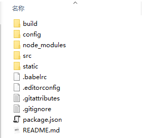

# 第一阶段vue的架构



+ clone后本，进入项目文件夹（如上），执行npm insatll 安装依赖。

+ 之后其他文件夹不用管，进入src文件夹，如下：

``` bash
  |---src
  	|---common：存放一些公共文件如.css，也可以放一些公共图片
  	|---components
  		|---Hello:测试文件
  		|---Index
  			|---Index.vue：实现初始页面的UI
  		|---Register
  			|---Register.vue:实现注册页面的UI
  		|---Signin
  			|---Signin.vue：实现登录页面的UI
  	|---module
  		|---index
  			|---image：存放初始页面需要用到的一些图片
  			|---App.vue：中间组件，用来综合其他index页面内需要用到的组
  			|---index.html:初始页面
  			|---index.js:初始页面的入口文件
  		|---register
  			|---image：同上
  			|---App.vue:中间组件，用来综合其他注册页面需要用到的组件（在component文件夹下）
  			|---register.html:注册页面
  			|---register.js:注册页面的入口文件
  		|---signin
  			|---image：同上
  			|---App.vue：同样是登录页面的中间组件
  			|---signin.html:登录页面
  			|---signin.js：登录页面的入口文件

```